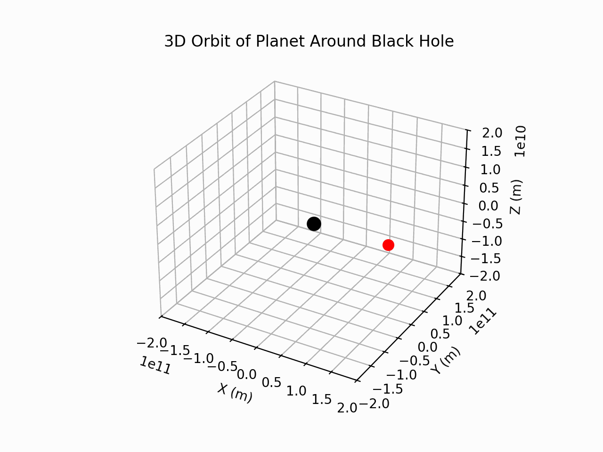

# 3D Orbit Simulation: Plotting Planetary Trajectories

This project simulates and visualizes the 3D orbit of a planet around a black hole. It uses numerical integration to solve the equations of motion and produces an animated plot of the planet's trajectory. 

## Features

- **3D Visualization**: The script produces an animated 3D plot of the planet's orbit.
- **Customizable Parameters**: You can adjust the mass of the black hole, initial position, and velocity of the planet.
- **Numerical Integration**: Uses `scipy` to solve differential equations for accurate orbit modeling.

## Parameters

You can customize the following parameters directly in the `plot_orbit.py` script:

- **Black Hole Mass**: (`M_blackhole`) Adjust the mass of the black hole in kilograms.
- **Initial Position**: (`initial_position`) Specify the (x, y, z) coordinates of the planet's starting position in meters.
- **Initial Velocity**: (`initial_velocity`) Specify the (vx, vy, vz) components of the planet's initial velocity in meters per second.
- **Simulation Time Span**: (`T`) Adjust the time span over which the simulation runs (in seconds).
- **Number of Points**: (`num_points`) Increase or decrease the number of points for more detailed or faster simulations.

## Output

When you run the `plot_orbit.py` script, you will see a 3D plot of the orbit simulation. The plot shows:
- The **blue line** representing the trajectory of the planet.
- The **red marker** showing the planet's current position.
- A **black marker** representing the black hole.

## Author

**Lewis Clifford**
